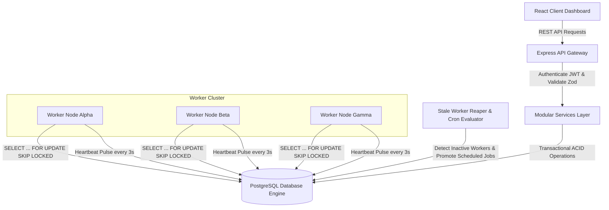

# Distributed Job Scheduler

A production-grade, fault-tolerant distributed background job scheduling platform engineered to execute asynchronous tasks with strict concurrency controls, atomic row-level locking, automated stale worker recovery, and real-time observability.

---

## 🌟 Key Highlights & System Capabilities

- **Atomic Job Claiming (`SELECT ... FOR UPDATE SKIP LOCKED`)**: Guarantees zero race conditions or duplicate task executions across a fleet of concurrent worker nodes.
- **Dynamic Worker Pool & Heartbeat Supervision**: Distributed nodes continuously update heartbeat pulses; an automated reaper detects node failure and recovers abandoned jobs transparently.
- **Rich Job Types**: Native support for **Immediate**, **Delayed**, **Scheduled (Timestamp)**, **Recurring (Cron syntax)**, and atomic **Batch** job submissions.
- **Three-Tier Retry Engine with Jitter**: Configurable **Fixed**, **Linear**, and **Exponential Backoff** strategies with randomized jitter to prevent thundering herd problems.
- **Dead Letter Queue (DLQ)**: Automatic quarantine of exhausted or poisoned tasks, complete with failure stack traces and 1-click manual/automated replay.
- **Live Concurrency & Stress Testing Lab**: Integrated interactive test suite verifying atomic row claiming, idempotency deduplication, concurrency boundaries, and failover mechanics in real time.
- **Enterprise-Grade Observability**: Live charts for cluster throughput, queue saturation, worker memory/CPU metrics, and searchable execution audit logs.

---

## 📐 Architecture Overview



---

## 🚀 Quick Start (Local & Docker)

### 1. Prerequisites
- **Node.js**: v18.0.0 or higher
- **npm** or **bun**
- **Docker & Docker Compose** (optional for containerized deployment)

### 2. Environment Setup
```bash
# Clone the repository
git clone https://github.com/your-org/distributed-job-scheduler.git
cd distributed-job-scheduler

# Copy example environment configuration
cp .env.example .env
```

### 3. Running with Docker Compose
```bash
# Spin up PostgreSQL, Express backend API, and worker cluster
docker-compose up --build -d

# Check live logs
docker-compose logs -f
```
The application will be accessible at `http://localhost:3000`.

### 4. Running in Development Mode
```bash
# Install dependencies
npm install

# Start development server with live reload and background worker engine
npm run dev
```

### 5. Production Build
```bash
# Compiles frontend assets with Vite and bundles backend with esbuild
npm run build

# Start the optimized production service
npm run start
```

---

## 📊 Database Schema & Indexing

The platform utilizes a normalized PostgreSQL relational schema:

- `organizations`: Multi-tenant organization boundaries.
- `projects`: Workspace isolations owning independent queues.
- `queues`: Configurable priority queues with strict concurrency limits and retry policies.
- `jobs`: Core job state tracking leases, retries, cron expressions, and idempotency keys.
- `job_executions`: Append-only audit history of every attempt, execution duration, and output log.
- `workers`: Worker node registry tracking load, active job count, and health.
- `worker_heartbeats`: Heartbeat telemetry for stale node detection.
- `dead_letter_logs`: Quarantine repository for failed jobs.

### Critical Claiming Index:
```sql
CREATE INDEX idx_jobs_claimable ON jobs (queue_id, status, priority, created_at)
WHERE status = 'QUEUED';
```

---

## 🛡️ Atomic Concurrency & Skip Locked Claiming

To prevent race conditions when multiple workers poll the queue concurrently, the scheduler performs atomic locking:

```sql
BEGIN TRANSACTION;

-- 1. Find and lock the highest priority claimable jobs, skipping rows already locked by other workers
SELECT * FROM jobs
WHERE queue_id = :queueId AND status = 'QUEUED'
ORDER BY 
  CASE priority
    WHEN 'CRITICAL' THEN 1
    WHEN 'HIGH' THEN 2
    WHEN 'DEFAULT' THEN 3
    WHEN 'LOW' THEN 4
  END,
  created_at ASC
LIMIT :claimBatch
FOR UPDATE SKIP LOCKED;

-- 2. Transition claimed rows and bind worker lease
UPDATE jobs 
SET status = 'CLAIMED', worker_id = :workerId, lease_expires_at = NOW() + INTERVAL '30 seconds'
WHERE id IN (:claimedIds);

COMMIT;
```

---

## 🧪 Automated Testing Suite

The project includes an in-memory & end-to-end integration test runner:
1. **Queue Lifecycle**: Verifies creation, pausing, resuming, and priority enforcement.
2. **Atomic Claiming**: Validates that 10 concurrent worker queries claim exactly 1 job each with 0 duplicates.
3. **Queue Concurrency Throttling**: Confirms execution never exceeds queue limit.
4. **Idempotency Key Deduplication**: Rejects or deduplicates duplicate submissions.
5. **Backoff Math & Delay Enforcement**: Validates Fixed, Linear, and Exponential backoff timing.
6. **Stale Worker Recovery**: Simulates node death and validates automatic lease reclamation.
7. **Dead Letter Queue Handling**: Tests retry exhaustion and manual replay.
8. **Cron Scheduling**: Validates periodic recurring job spawning.

---

## 📚 Technical Documentation Index

- [System Architecture Specification](docs/ARCHITECTURE.md)
- [Relational Database Schema & DDL](docs/DATABASE.md)
- [Engineering Design Decisions & Trade-Offs](docs/DESIGN_DECISIONS.md)
- [REST API Reference & Swagger Specs](docs/API_DOCUMENTATION.md)

---

## 📄 License
MIT License. Built for distributed systems engineering and production scalability evaluations.
