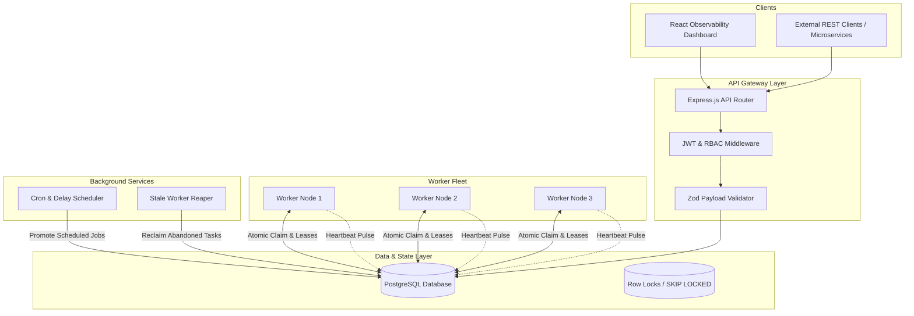
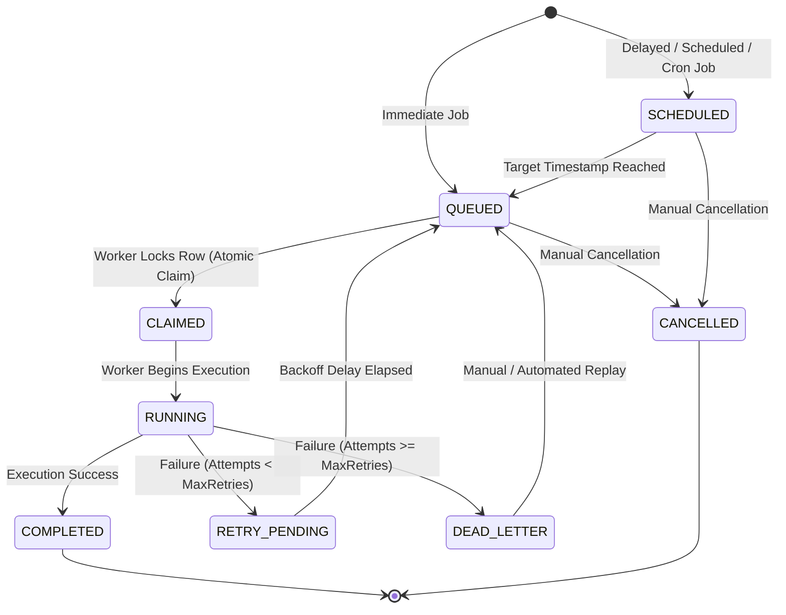

# System Architecture & Technical Specifications

This document outlines the distributed architecture, component interactions, execution lifecycle, and fault-tolerance mechanics of the **Distributed Job Scheduler**.

---

## 1. High-Level Architecture

The system is decoupled into four primary layers:
1. **API Ingestion & Presentation Layer**: Express.js REST APIs with Zod schema validation, JWT auth middleware, and a React + Tailwind observability dashboard.
2. **Persistence & Lock Coordination Layer**: Normalized relational PostgreSQL database with row-level transaction locks (`SELECT ... FOR UPDATE SKIP LOCKED`).
3. **Autonomous Worker Fleet**: Scalable worker instances that continuously poll prioritized queues, enforce concurrency throttles, execute jobs concurrently, and transmit heartbeats.
4. **Supervisory Services**: Background Scheduler Service (evaluating Cron and promoting delayed tasks) and Stale Worker Reaper (reclaiming abandoned tasks from crashed nodes).

---

## 2. Job State Machine & Lifecycle

Every job flows through a deterministic, strictly validated state machine:

### State Definitions:
- **`QUEUED`**: Ready for immediate claiming by eligible workers.
- **`SCHEDULED`**: Awaiting future target timestamp or cron trigger.
- **`CLAIMED`**: Leased by an active worker under a transactional lock.
- **`RUNNING`**: Actively executing inside a worker process thread.
- **`COMPLETED`**: Successfully finished; results and duration recorded.
- **`RETRY_PENDING`**: Failed with retries remaining; waiting for backoff timer.
- **`DEAD_LETTER`**: Exhausted all retry attempts; quarantined in DLQ for analysis.
- **`CANCELLED`**: Revoked by user before execution.

---

## 3. Worker Node Architecture

Each worker instance is an autonomous consumer with the following subsystems:

1. **Queue Poller**: Periodically scans active queues ordered by priority (`CRITICAL` > `HIGH` > `DEFAULT` > `LOW`).
2. **Concurrency Governor**: Ensures the worker's active executing jobs do not exceed `worker.concurrencyLimit` AND the queue's global `concurrencyLimit`.
3. **Execution Engine**: Sandboxed async executor with timeout protection, execution step logging, and error interception.
4. **Heartbeat Emitter**: Sends heartbeat telemetry every 3 seconds to prove node liveness.
5. **Signal Handler**: Intercepts `SIGTERM` / `SIGINT` to pause polling and allow active running tasks to drain cleanly before terminating.

---

## 4. Failure Recovery & Stale Worker Reaping

If a worker node crashes (OOM, container death, network partition):
1. The worker stops updating its `worker_heartbeats` table.
2. The **Stale Worker Reaper** runs every 4 seconds and detects workers whose `last_heartbeat` is older than the 10-second threshold.
3. The Reaper marks the dead worker as `OFFLINE`.
4. Any jobs assigned to that worker that are in `CLAIMED` or `RUNNING` status are automatically reset back to `QUEUED` (or `RETRY_PENDING`), incrementing the attempt count.
5. Healthy workers immediately pick up the abandoned tasks.
