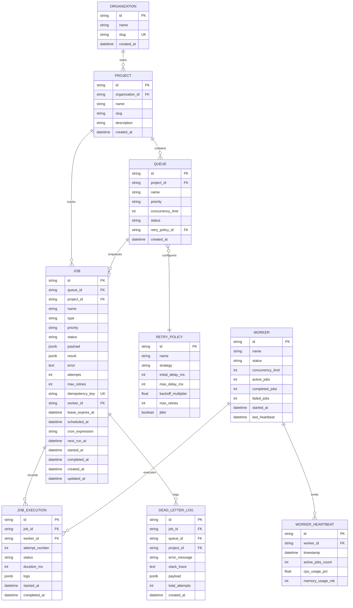

# Relational Database Design & Schema Specifications

This document outlines the entity-relationship architecture, table definitions, foreign key relationships, cascading rules, and indexing strategy for the **Distributed Job Scheduler**.

---

## 1. Entity-Relationship Diagram



---

## 2. Table Definitions & Schemas

### 1. `organizations`
Multi-tenant boundary for teams and enterprises.
- `id` (VARCHAR(64) PRIMARY KEY): Unique identifier.
- `name` (VARCHAR(255) NOT NULL): Display name.
- `slug` (VARCHAR(255) UNIQUE NOT NULL): URL-safe slug.
- `created_at` (TIMESTAMP DEFAULT NOW()).

### 2. `projects`
Logical workspaces under an organization.
- `id` (VARCHAR(64) PRIMARY KEY).
- `organization_id` (VARCHAR(64) REFERENCES organizations(id) ON DELETE CASCADE).
- `name` (VARCHAR(255) NOT NULL).
- `slug` (VARCHAR(255) NOT NULL).
- `description` (TEXT).
- `created_at` (TIMESTAMP DEFAULT NOW()).

### 3. `queues`
Defines independent priority processing pipelines.
- `id` (VARCHAR(64) PRIMARY KEY).
- `project_id` (VARCHAR(64) REFERENCES projects(id) ON DELETE CASCADE).
- `name` (VARCHAR(255) NOT NULL).
- `priority` (VARCHAR(32) DEFAULT 'DEFAULT'): `CRITICAL`, `HIGH`, `DEFAULT`, `LOW`.
- `concurrency_limit` (INT DEFAULT 5): Maximum jobs executing simultaneously in this queue.
- `status` (VARCHAR(32) DEFAULT 'ACTIVE'): `ACTIVE`, `PAUSED`.
- `retry_policy_id` (VARCHAR(64) REFERENCES retry_policies(id)).
- `created_at` (TIMESTAMP DEFAULT NOW()).

### 4. `jobs`
Core job entity tracking lifecycle, state, scheduling, and leases.
- `id` (VARCHAR(64) PRIMARY KEY).
- `queue_id` (VARCHAR(64) REFERENCES queues(id) ON DELETE CASCADE).
- `project_id` (VARCHAR(64) REFERENCES projects(id) ON DELETE CASCADE).
- `name` (VARCHAR(255) NOT NULL).
- `type` (VARCHAR(32) NOT NULL): `IMMEDIATE`, `DELAYED`, `SCHEDULED`, `RECURRING`, `BATCH`.
- `priority` (VARCHAR(32) NOT NULL).
- `status` (VARCHAR(32) NOT NULL): `QUEUED`, `SCHEDULED`, `CLAIMED`, `RUNNING`, `COMPLETED`, `RETRY_PENDING`, `DEAD_LETTER`, `CANCELLED`.
- `payload` (JSONB NOT NULL).
- `result` (JSONB).
- `error` (TEXT).
- `attempts` (INT DEFAULT 0).
- `max_retries` (INT DEFAULT 3).
- `idempotency_key` (VARCHAR(255) UNIQUE).
- `worker_id` (VARCHAR(64)).
- `lease_expires_at` (TIMESTAMP WITH TIME ZONE).
- `scheduled_at` (TIMESTAMP WITH TIME ZONE).
- `cron_expression` (VARCHAR(64)).
- `next_run_at` (TIMESTAMP WITH TIME ZONE).
- `started_at` (TIMESTAMP WITH TIME ZONE).
- `completed_at` (TIMESTAMP WITH TIME ZONE).
- `created_at` (TIMESTAMP WITH TIME ZONE DEFAULT NOW()).
- `updated_at` (TIMESTAMP WITH TIME ZONE DEFAULT NOW()).

### 5. `job_executions`
Append-only audit ledger recording every execution attempt.
- `id` (VARCHAR(64) PRIMARY KEY).
- `job_id` (VARCHAR(64) REFERENCES jobs(id) ON DELETE CASCADE).
- `worker_id` (VARCHAR(64) NOT NULL).
- `attempt_number` (INT NOT NULL).
- `status` (VARCHAR(32) NOT NULL): `RUNNING`, `SUCCESS`, `FAILURE`.
- `duration_ms` (INT).
- `logs` (JSONB DEFAULT '[]').
- `started_at` (TIMESTAMP WITH TIME ZONE DEFAULT NOW()).
- `completed_at` (TIMESTAMP WITH TIME ZONE).

---

## 3. High-Performance Indexing Strategy

```sql
-- 1. Optimized Partial Compound Index for Concurrent Worker Polling
CREATE INDEX idx_jobs_claimable ON jobs (queue_id, status, priority, created_at)
WHERE status = 'QUEUED';

-- 2. Fast Scheduler Promotion Index for Delayed / Scheduled Jobs
CREATE INDEX idx_jobs_scheduled_due ON jobs (status, scheduled_at)
WHERE status = 'SCHEDULED';

-- 3. Stale Lease Detection Index
CREATE INDEX idx_jobs_running_leases ON jobs (status, lease_expires_at)
WHERE status IN ('CLAIMED', 'RUNNING');

-- 4. Idempotency Key Lookup Index
CREATE UNIQUE INDEX idx_jobs_idempotency ON jobs (idempotency_key)
WHERE idempotency_key IS NOT NULL;

-- 5. Execution History Lookup Index
CREATE INDEX idx_executions_job ON job_executions (job_id, started_at DESC);
```
